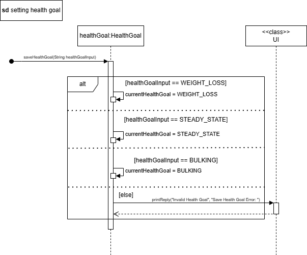
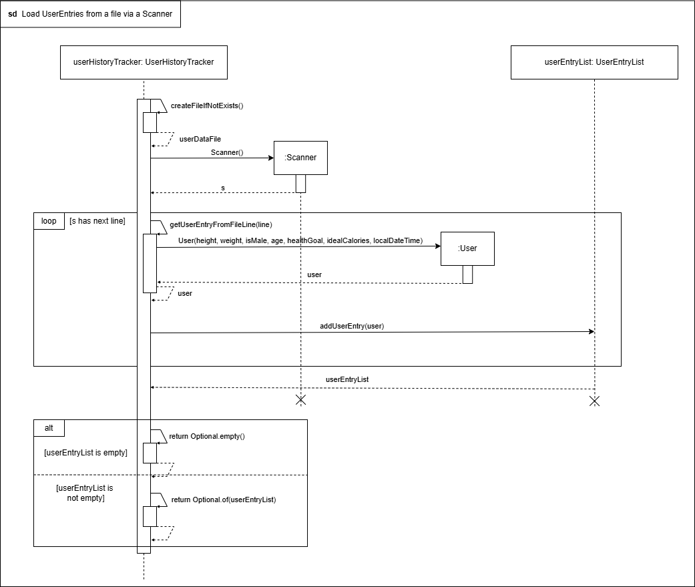

# Developer Guide

## Acknowledgements
ChatParser structure inspired by: 
[this repository](https://github.com/kennethSty/ip)
Calorie consumption bar inspired by 
[this blogpost](https://medium.com/javarevisited/how-to-display-progressbar-on-the-standard-console-using-java-18f01d52b30e)

## Design & implementation
The overall project is structured into six packages:
- Command: Classes used for abstracting user commands
- Core: Core classes
- Exceptions: Customized exceptions
- Recommender: TBD 
- Services: Key logic and services that make use of core classes
- Utils: Helper functions

### High Level Class Design
The main classes of this implementation are:
- HealthMate
- ChatParser
- User
- MealList
- MealEntriesList
- Meal
- MealEntry
- HistoryTracker
- UI

In each class we focused on maintaining a tight abstraction barrier between classes.
This specifically includes adherance to the "Tell Don't Ask" principle which was enforced by
making most attributes of all classes above private and avoiding getter methods if possible.
The following diagram illustrates the resulting associations, methods and attributes.
For the sake of clarity, classes which are not central corner stones for a high-level overview are ommitted.

#### HealthMate
Entry point to the application is the main function of HealthMate.
The HealthMate class contains a private ChatParser attribute. This attribute's run function initiates, 
after an initial greeting to the user, the interaction process. In this process, 
the user enters commands with additional information into his command line application.
The content of these commands is parsed by the ChatParser. 

#### ChatParser
The ChatParser class, instantiated once per application run, manages HealthMates overal usage 
flow through its main run() method. 

It has two primary attributes: 
- A `MealEntriesList` object called `mealEntries` 
  - Contains tracked calorie consumption 
- A `MealList` object called `mealOptions` 
  - Contains meals that are presaved by the user for quick selection to track commonly consumed meals
  - the command `meal menu` is used to display the current mealOptions. The implementation of this command is shown in the UML diagram below.

These objects represent the application's underlying data with which the user interacts through the command line.
To ensure no unintended changes are done, the ChatParser class orchestrates the effects of the users prompts.
For saving these changes the ChatParser class makes use the `HistoryTracker`  which facilitates the process of 
storing (and loading) User data, mealEntries data and mealOptions data to their corresponding files. 

More details on the implementation of ChatParser follows in the Feature Section. 

#### MealList
The MealList class contains a private ArrayList of Meal object.
Further, it encapsulates behaviour to operate on this list of meals. Most notably, 
this adding or deleting a Meal to/from the list. 

#### MealEntriesList
The MealEntriesList class extends the MealList class. It overwrites the extractAndAppendMeal(...) method,
and additionally includes methods specifically tailored to providing helpul user feedback, as the MealEntries stored 
within its instance, signify the users calorie consumption. 
As a MealEntry object differs from a Meal object by the additional timestamp attribute, this includes
computations based on the time dimension. More specifically, the printDaysConsumptionBar() uses the UIs class'
methods in the background to visualize the percentage of a certain days total consumption versus the idaeal consumption
of a User class. 

#### Meal
The Meal class encapsulates the concept of a meal. As the purpose of this application 
is to track calorie consumption, this consists of a mandatory calorie entry. The meal's name attribute, 
is however an Optional<String> allowing a case, where no meaningful label can be attached to a certain consumption.

#### MealEntry
The MealEntry class extends the meal class and contains an additional field timestamp. 
This distinction was made, as objects of the Meal class will represent possible meal options to choose form, 
while a mealEntry is a concrete calorie consumption the user wants to track. The latter makes a timestamp indispensible. 

#### HealthGoal
The HealthGoal class manages a user's health goal and calculates target calorie intake based on user data such as height, weight, age, and gender. 
It offers three main health goals: weight loss, steady state, and bulking, each with a corresponding calorie modification factor. 
The class supports setting, storing, and retrieving the health goal. 
Additionally, it provides a method to compute target calories using the Harris-Benedict Equation, modified by the current health goal. 
This allows the class to adapt the calorie calculations according to the user's health objectives, making it versatile for various fitness plans.

The implementation of setting of a healthGoal for example is shown below:

#### User
The user class encapsulates all necessary information for computing an ideal daily calorie consumption. 
This includes:
- Height (in cm): Double 
- Weight (in cm): Double
- Age: Integer
- Gender: Boolean
- Health goal: HealthGoal
- Ideal calorie intake: Computed based on the information above 
- Date: LocalDateTime specifying the date of the above information
More details follow in the Features section of this guide. 

#### HistoryTracker
The HistoryTracker class is responsible for managing the persistence of data in the HealthMate application. It handles the saving and loading of user data, meal entries, and meal options to and from files. This class plays a crucial role in maintaining the application's state across different sessions.

Key features of the HistoryTracker class include:

1. Data Persistence:
   - Saves user data, meal entries, and meal options to separate files.
   - Loads existing data from these files when a new usage session is initiated.

2. File Management:
   - Creates and manages the necessary files for storing application data.
   - Handles file I/O operations, ensuring data integrity during read and write processes.

3. Data Formatting:
   - Converts complex objects (like User, MealEntry, and Meal) into a format suitable for file storage.
   - Deserializes stored data back into usable objects when loading the application state.

HistoryTracker allows for the persistance of user inputted data between sessions by storing it in a local csv file.

## Features

This section will document the contributions made by each team member regarding the implementation or planned feature enhancements, detailing the design and thought processes behind them.

---
### Creating a User Profile
To create or load a user profile the `UserHistoryTracker` class provides the method `checkForUserData` which loads 
saved user information if available from an existing file or prompts the user
to input new information for creating a new profile as shown in the sequence diagram below.

Reference diagrams used

### ChatParser Input Handling
The 'ChatParser' class has the responsibility of parsing user input to steer the 
application logic based on predefined commands specified in the `CommandMap' class.
Therefore, the ChatParser class acts as the main interface between user input and command execution. 
This includes extracting and routing commands, as well as exception handling for 
false input. 

#### Feature Implementation
The `ChatParser class:`
1. Accepts user input. I.e. it reads input from the command line
2. Tokenizes commands and identifys one- and two-token commands
3. Routes commands based on the identified command tokens which are specified in the `CommandMap` class. This is done 
using methods such as `multiCommandParsing` for 2-token commands and `run` which encapsulates the main loop of
user interaction until the exit command "bye" terminates the application.
4. Logs command routing and its effects on a high level to enable tracking of the application's activity.

#### Why It Is Implemented This Way
The ChatParser class was implemented in the above manner for three reasons:
1. It allows create one abstract unit for handling the responsibility of orchestrating usage flow.
2. As a high-level abstraction layer it improves readability by bundliing the overall application logic in one place.
3. Its modularity allows for easy extensions or modifications to `CommandMap` and `multiCommandParsing`. 

#### Alternatives considered
Direct command handling in the main loop. Reduces the depth of the application, 
but comes at the cost of reduced readability and higher cohesion. 

#### Extensions for v.2.1
Separating the responsibilities of reading and preprocessing user input from the responsibility 
to steer command routing. This could improve the maintainability of the ChatParser class in the future. 

### Command Handling with CommandMap Class

#### Overview

The `CommandMap` feature enhances the system's command handling by centralizing the lookup, and
storage of commands. It allows users to efficiently view commands usage within the HealthMate application.

#### Feature Implementation

The `CommandMap` class in the `seedu.healthmate.command` package maps command names to their corresponding
`Command` objects using a `HashMap<String, Command>`. This ensures fast retrieval and allows users to explore
commands with ease.

#### Why It Is Implemented This Way

Using a `HashMap` allows efficient command lookups with a constant time complexity of O(1). Centralizing all
commands within `CommandMap` simplifies the system's command handling process and makes it more maintainable  as new
commands are added.

#### Alternatives Considered

An alternative was storing commands in a list and iterating through them sequentially to find the matching command.
However, this approach was less efficient for frequent lookups compared to the `HashMap`.

#### Proposed additions for future

The `CommandMap` can be built upon to support saving and usage of user created scripts as commands. For example
using a user could possibly create an add morningRoutine command by creating a command that runs multiple add
mealEntry commands of their regular breakfast as well as triggering the updateUser data command.

#### Sequence Diagram

1. **Command Lookup Process**: Illustrate the flow from when a user enters a command to when `CommandMap.
getCommandByName()` retrieves the command and the UI displays the results.
   - Components: `UI`, `ChatParser`, `CommandMap`.
   - Highlight how `CommandMap` retrieves the appropriate command based on user input.

### Delete Meal and MealEntry Commands

#### Overview

The `delete` commands allow users to be able to delete any `meal` or `mealEntry` they may have put in.
It allows users to be able to delete any erroneous entry they may have put in.

#### Feature Implementation

The `delete meal` and `delete mealEntry` Commands are classes in the `seedu.healthmate.command` package.
When called by the user from ChatParser the `executeCommand` method will be called 
executing the command as necessary.
This is also how all other commands are executed.

To delete a `meal` or `mealEntry` the respective index of it must be included after the command.

#### Why It Is implemented This Way

Inline with the `Single-Responsibility Principle (SRP)` the execution commands were abstracted 
and were put into the respective Commands. This allowed for neater and more readable code while also
allowing for less nesting inline with the `SLAP Principle`.

The index of `meal` or `mealEntry` was used to delete it as it had less edge cases while also being
more consistent from the user's point of view.

#### Alternatives Considered

Initially the code to execute the commands were in the `ChatParser` class but this made it messy and 
caused a lot of unnecessary nesting. Debugging the `ChatParser` class was also much harder due to this.
Therefore, the execution code and it's helper functions were shifted to the various command classes.

The deletion of a `meal` option by using it's name was also considered. However this was found to be
less intuitive from a user point of view. Some larger `meal` names (eg. `Hawaiian Pizza with Mushrooms`)
may be harder for the user to input correctly in order to delete. From a usability perspective, 
just requiring the index makes it simpler for the user.

#### Future Additions

A find command could be implemented that could help users find the index and details of 
the `meal` or `mealEntry` that they would like to delete. Would be helpful for the user as
too many entries may make it hard for the user to find the one they would like to delete.

#### Sequence Diagram TBD
1. **Delete Meal `executeCommand` Sequence Diagram**
2. **Delete MealEntry `executeCommand` Sequence Diagram**

---

## Product scope
### Target user profile

The target user profile for HealthMate includes:
- Health-conscious individuals who want to monitor their daily calorie intake
- Users comfortable with command lines
- People trying to lose weight, maintain a healthy weight or increase muscle growth
- Fitness enthusiasts who want to balance their calorie consumption with their exercise routines
- Individuals with specific dietary requirements or restrictions
- Busy individuals who need a quick way to log meals and monitor progress.
- Data-Oriented Users: Users interested in gathering data about their habits to improve them
- Anyone interested in developing better eating habits and nutritional awareness

A typical HealthMate user is Martin. 
He is a 30-year-old software engineer who wants to maintain a healthy lifestyle with the help of technology.
Additionally, he has the following characteristics:
* Health-conscious individual: Martin want to pay attention to his diet. He believes in the importance of monitoring calorie intake to achieve optimal health.
* Command-line expertise: As a software engineer, Tom is extremely comfortable using command-line interfaces and appreciates the simplicity and efficiency they offer. 
* Fitness enthusiast: Martin regularly engages in workouts. He aims to build muscle mass while maintaining a healthy body weight, which he achieves by balancing his calorie intake with his exercise routine.
* Data-oriented self-improvement mindset: Martin loves leveraging data to optimize his meal plans. He sets goals, tracks progress, and analyzes trends to continuously improve his habits.

### Value proposition

HealthMate solves the following problems:
- Difficulty in tracking daily calorie intake: Users can easily log their meals and snacks
- Lack of awareness about ideal calorie consumption: Based on the users health goal and his physical attributes, the app calculates the ideal daily calorie intake for this specific user.
- Lack of motivation: By visually showing the daily progress towards the users ideal calorie consumption, the app motivates to reach this goal on a daily basis.
- Inconvenience of manual calorie calculations: Pre-saved meal options make tracking quicker and more efficient
- Inability to see patterns in eating habits: Historical data allows users to analyze their consumption over time
- Struggle to maintain consistent healthy eating habits: Regular tracking encourages mindful eating and helps users stay accountable to their health goals

## User Stories

| Version | As a ...       | I want to ...                                                                                      | So that I can ...                                                    |
|---------|----------------|----------------------------------------------------------------------------------------------------|----------------------------------------------------------------------|
| v1.0    | new user       | see usage instructions                                                                             | refer to them when I forget how to use the application               |
| v1.0    | user           | save frequently eaten meals                                                                        | quickly add them in the future without re-entering details           |
| v1.0    | user           | log my daily meals                                                                                 | track my calorie intake                                              |
| v1.0    | user           | see my calorie consumption                                                                         | know if I'm meeting my daily goals                                   |
| v1.0    | user           | delete a previously logged consumption                                                             | undo mistakes when tracking my meals                                 |
| v1.0    | user           | set my health goals                                                                                | have a target to work towards                                        |
| v2.0    | user           | see my meal history                                                                                | analyze my eating patterns over time                                 |
| v2.0    | user           | know how much calories I should consume per day based on my health goal and my physical properties | plan my future eating habits accordingly                             |
| v2.0    | user           | see visual representations of how much of my ideal daily consumption I have eaten                  | better plan the rest of my daily consumption                         |
| v2.0    | motivated user | get a visual overview on my daily actual vs. ideal calorie intake over a specified timerange       | better track my progress of developing a better eating habit         |
| v2.0    | user           | specify the amount of portions I eat of a meal                                                     | enter the consumption of a meal only once innstead of multiple times |
| v2.0    | user           | export my data                                                                                     | back up my records or analyze them elsewhere                         |
| v2.0    | user           | create custom meal combinations                                                                    | quickly log common meal combinations                                 |
| v2.0    | forgetful user | add calorie consumptions for past days                                                             | keep track of my consumption even if I forgot to enter it first      |

## Non-Functional Requirements

1. Usability: The command-line interface should be intuitive and easy to use, even for non-technical users.
2. Reliability: The application should not lose any user data during normal operation or unexpected shutdowns.
3. Compatibility: The application should run on common operating systems (Windows, macOS, Linux).
4. Maintainability: The code should be well-documented and follow clean code principles for easy future enhancements.
5. Portability: User data should be easily exportable and importable for backup purposes or switching devices.
6. UX: The application should make use of intuitive visuals to help the user get insights into his eathing habits.
7. Performance: The application should respond to all user commands without negatively noticable delay.
7. Scientific: The app should calculate ideal calorie consumption based on evidence from science.

## Glossary

* *Meal* - A food item or combination of food items consumed at one time, with associated calorie information.
* *MealEntry* - A record of a meal consumed by the user, including the meal details and a timestamp.
* *MealList* - A collection of pre-saved meals that users can quickly select from when logging their food intake.
* *MealEntriesList* - A chronological list of all meals consumed by the user.
* *ChatParser* - The component responsible for interpreting user commands and executing the appropriate actions.
* *HistoryTracker* - The component that manages the storage and retrieval of meal entries, and meal options.
* *UserHistoryTracker* - The component that manages the storage and retrieval of user data.
* *HealthGoal* - The class that manages functions pertaining to setting of user health goal as well calculating ideal caloric intake based on various factors.

## Instructions for manual testing

1. Installation and Setup:
   - Ensure Java Runtime Environment (JRE) is installed on your system.
   - Download the HealthMate application JAR file.
   - Open a terminal or command prompt and navigate to the directory containing the JAR file.

2. Running the Application:
   - Execute the command: `java -jar HealthMate.jar`
   - Verify that the application starts and displays a welcome message.

3. Testing Basic Commands:
   - Do note our commands are not case-sensitive except for our special parameters (/c,/p,/t)
   - Try entering the command `list commands` and verify that usage instructions are displayed.
   - Test the `bye` command to ensure the application exits properly.

4. Saving a Meal:
   - Use the command `save meal [name] [calories]` (e.g., `save meal Chicken Salad /c350`)
   - Verify that the meal is added successfully and displayed in the meal list using `meal menu`

5. Adding a Meal Entry:
   - Use the command `add mealEntry [meal from menu/ standalone meal name] [calories if standalone meal] [portion]` 
   (e.g., `add mealEntry Chicken Salad /p3`) or (`add mealEntry newmeal /c300 /p1`)
   - Check that the meal entry is recorded with the current timestamp.

6. Show Historic Caloric Trend:
   - Use the command `show historicCalories [no. of days]` (e.g., `show historicCalories 5`)
   - Check that the calories added previously are shown and that all the stats displayed are correct

7. Testing Data Persistence:
   - Exit the application using the `bye` command.
   - Restart the application and check if previously added meals and logged entries are still present.

8. Error Handling:
   - Try entering invalid commands or data to ensure the application handles errors gracefully and provides helpful error messages.
